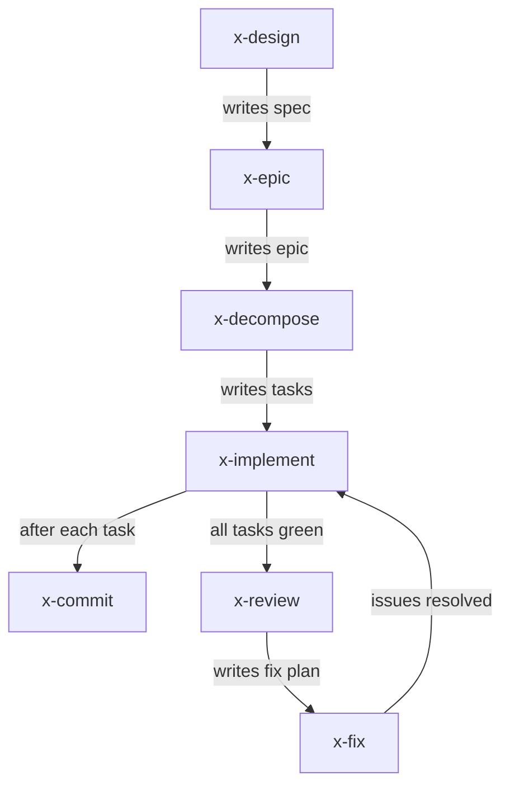

# xskills

Cross-CLI agentic skills installer. Install once, use with **45+ compatible AI coding tools**.

**xskills doesn't just teach your agent — it hands it real AST complexity analysis, commit validation, and duplication detection wired into a complete workflow chain from design to review.**

## What is this?

Skills are the [Agent Skills open standard](https://agentskills.io) — a folder with a `SKILL.md` file (YAML frontmatter + Markdown instructions) plus optional `scripts/`, `references/`, and `assets/` subdirectories. They give AI coding agents specialized knowledge and workflows.

**One format, all CLIs.** No adapters needed.

## Supported CLIs

| CLI | Status |
|-----|--------|
| [Claude Code](https://docs.anthropic.com/en/docs/claude-code) | Native |
| [Gemini CLI](https://github.com/google-gemini/gemini-cli) | Native |
| [Crush](https://github.com/charmbracelet/crush) | Native |
| [OpenCode](https://github.com/sst/opencode) | Native |
| [Roo Code](https://github.com/RooCodeInc/Roo-Code) | Native |
| [Goose](https://github.com/block/goose) (Block) | Native |
| [OpenAI Codex](https://github.com/openai/codex) | Native |
| [Mistral Vibe](https://github.com/mistralai/mistral-vibe) | Native |
| [NanoBot](https://github.com/HKUDS/nanobot) | Native |
| [Aider](https://aider.chat) | Via `.agents/skills/` discovery |
| [Cursor](https://cursor.sh) | Via `.agents/skills/` discovery |
| **45+ total** | [See full list](https://agentskills.io/clients) |

## Install

```bash
# One command — installs into current project
npx xskills install <skill-name>

# Install globally (available in all projects)
npx xskills install <skill-name> --global

# Shortcut — just type the skill name
npx xskills <skill-name>
```

## Available Skills

Run `npx xskills list` to see all available skills. Each skill may include:
- **scripts/** — executable code (Node.js, Bash, Python)
- **references/** — documentation, type maps, examples
- **assets/** — configs, templates, reusable files

| Skill | Description |
|-------|-------------|
| `x-commit` | Write single-line conventional commit messages with automated type suggestion and validation |
| `x-review` | Review code against SRP, SOLID, KISS, DRY with cyclomatic complexity and duplication analysis — saves fix plan to markdown |
| `x-fix`    | Resolve code review issues one-by-one from a fix plan file until complete |
| `x-design` | Spec-driven design — clarify vague goals, propose approaches with trade-offs, write testable specs, gate on approval |
| `x-epic`   | Convert approved spec into outcome-focused epics — user stories (INVEST), scope boundaries, epic-level DOD checklist |
| `x-decompose` | Decompose epic into atomic tasks — each ≤8h with Definition of Done, test plan, effort estimate, dependency tracking |
| `x-implement` | Test-driven implementation — red/green/refactor per plan task, docs sync, commit via x-commit |

## Skill Flow

The skills compose into a production workflow:



- **x-design**: Clarify vague goals, propose approaches with trade-offs, write specs (contract, invariant, test), gate on approval.
- **x-epic**: Read spec → derive user stories following INVEST criteria, define scope boundaries and epic-level Definition of Done, gate on approval.
- **x-decompose**: Read epic → decompose into atomic tasks (≤8h each) with DOD checklist, explicit test plan (happy + error paths), effort estimate in hours, dependency DAG. Enforced size gates prevent oversized tasks.
- **x-implement**: TDD (red→green→refactor) per task, sync docs, flip checkboxes on task file.
- **x-commit**: Conventional commit messages — analyze staged changes, validate format, commit atomically. Used at each task boundary.
- **x-review**: AST complexity + duplication analysis, apply SOLID/KISS/DRY/SRP principles, save fix plan.
- **x-fix**: Resolve review issues one-by-one by priority (CRITICAL → MAJOR → MINOR), test after each.

## How It Works

1. Skills live in `.agents/skills/` following the [Agent Skills spec](https://agentskills.io/specification).
2. Compatible CLIs scan this directory and discover skills automatically.
3. Skills use **progressive disclosure** — lightweight catalog at startup, full instructions only when needed.

## Directory Structure After Install

```
my-project/
├── .agents/
│   └── skills/
│       ├── x-commit/
│       │   ├── SKILL.md          # Instructions the agent reads
│       │   ├── scripts/           # Portable scripts
│       │   ├── references/        # Docs & examples
│       │   └── assets/            # Configs & templates
│       └── ...
```

## Create Your Own Skill

1. Create a folder: `my-skill/`
2. Add `SKILL.md` with YAML frontmatter:

```markdown
---
name: my-skill
description: What it does and when the agent should use it.
---

# My Skill

Step-by-step instructions for the agent...
```

3. Optionally add `scripts/`, `references/`, `assets/` subdirectories.
4. Submit a PR or install locally via `npx xskills install ./path/to/my-skill`.

## License

MIT
