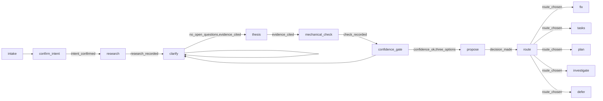

# X-Anal — Interactive Problem Analysis & Solution Proposal

Guide the user through understanding their problem, formulating a thesis with evidence, proposing solutions, and routing to the right action (fix or task creation). This is an interactive conversation skill — it asks questions, clarifies ambiguities, and only proceeds when confident.

## When to use

- "Why does X happen?", "analyze this problem", "what should we do about Y".
- A bug report or log dump that needs a thesis before a fix.
- You need evidence-backed options and a route, not a guess.

## Scenario

The run is a guarded graph. `state.json` is the source of truth; `memory.md` records every event;
the analysis lands at `.x-skills/anal/analysis-<slug>.md`.



```bash
node <skill>/scripts/scenario.mjs start --slug <slug>
node <skill>/scripts/scenario.mjs record --dir <dir> --event research --data "<finding>"
node <skill>/scripts/scenario.mjs record --dir <dir> --event evidence --data "<claim>" --target "<file:line|url>"
node <skill>/scripts/scenario.mjs record --dir <dir> --to <node>
node <skill>/scripts/scenario.mjs verify --dir <dir>   # exit 0 iff the stop is justified
```

| Gate | Passes when |
|------|-------------|
| `intent_confirmed` | the user confirmed your restatement |
| `research_recorded` | at least one research finding is recorded |
| `no_open_questions` | every question is answered |
| `evidence_cited` | at least one claim cites a `file:line` or URL |
| `check_recorded` | the mechanical check ran, or is recorded `not-run` with a reason |
| `confidence_ok` | confidence is high or medium |
| `three_options` | three distinct solutions are recorded |
| `decision_made` | the user picked a route |
| `route_chosen` | the route is recorded and `analysis-<slug>.md` is written |

Research before the first question (`references/research-first.md`), ask every question as a panel
(`references/questions.md`), then let `scripts/check-questions.mjs` check your questions before you ask
them. Completion: `verify` exits 0 at a route stop.

## Workflow (5 Phases)

### Phase 1: Confirm Understanding of Intent

When the user describes a problem (text + logs / error output / screenshots), restate what you believe they want solved in your own words. Show them this restatement and confirm it with a `confirm` panel before proceeding.

```
You say something like: "So you're saying that when X happens, Y occurs instead of Z. You want the behavior to be Z. Is that right?"
```

If the user corrects you, update your understanding and re-confirm. Do not proceed until intent is confirmed.

### Phase 2: Clarify Ambiguities

For every aspect of the problem you are uncertain about, ask a focused question as a panel (`single`, `multi`, `open`, or `confirm`) — never in prose. Group related questions but never ask more than 3 at once.

Suggested clarification dimensions (ask only what's genuinely unclear):

| Dimension | Example Question |
|-----------|-----------------|
| Expected behavior | "What exactly should happen instead?" |
| Reproduction | "Does it always happen, or only in certain conditions?" |
| Environment | "Which version / browser / OS is this on?" |
| Scope | "Is this affecting just one user, one workflow, or everywhere?" |
| Recent changes | "Did anything change recently — code, config, data?" |
| Impact | "How critical is this — blocking you now, or just annoying?" |

When asking for missing information, suggest concrete types:

- **Logs / error output** → ask user to paste console errors, server logs, stack traces
- **Database schema** → ask user to share relevant table structures or queries
- **Screenshots / screen recordings** → ask for visual evidence of the issue
- **Reproduction steps** → ask for minimal steps to trigger the problem
- **Configuration** → ask for environment variables, config files, .env values

### Phase 3: Analysis & Thesis

Once you have enough information (or the user confirms they want to proceed with what's available), produce an analysis in `.x-skills/anal/analysis-<slug>.md` (created by `scripts/scenario.mjs start`):

```markdown
# Analysis — <slug>

**Date:** YYYY-MM-DD HH:mm
**User Intent:** <confirmed restatement from Phase 1>
**Environment:** <platform, version, OS, etc.>

## Thesis
<One-sentence statement of what you believe is causing the problem>

## Evidence
- <Observation 1: cite specific log line, code snippet, or symptom with proof>
- <Observation 2: ...>
- <Reasoning that connects evidence to thesis>

## Confidence Level
<high | medium | low> — <brief reason for confidence assessment>

## Solution Proposition
### Option A: <name> (recommended)
**What:** <specific change or fix described clearly>
**Where:** <file(s) and location>
**Risk:** <low / medium / high — what could break>
**Effort:** <small / medium / large — time estimate>

### Option B: <alternative, if applicable>
**What:** ...
**Where:** ...
**Risk:** ...
**Effort:** ...

## Decision
<What the user chose to do — fix now, create tasks, gather more info, or defer>
```

**Mechanical check (when the thesis is testable).** Before assigning a confidence level, name the one check that would confirm or refute the thesis, and run it if you can — a command whose exit code or output decides it (e.g. `node repro.js`, `curl -s <url> | grep …`, `git log -S …`), or a concrete observation (a specific log line, a response header). Record it under a `## Mechanical check` heading in the analysis with the command and its result, and let that result set the confidence: a thesis the check confirms is high; one it refutes is not a thesis at all.

If the host gives you no shell or web capability, say so plainly, mark the check as *not run*, and fall back to the confidence gate in Phase 4.

### Phase 4: Confidence Gate

Before presenting the analysis:

- **High confidence** → present full thesis + solution proposition (Phase 3), then ask the user to approve and route with a `confirm` panel.
- **Medium confidence** → present thesis with caveats, explicitly state what additional information would increase confidence, and ask with a panel whether they want to provide more or proceed anyway.
- **Low confidence** → stop analysis, explain what's missing, request specific additional evidence from the user (logs, schema, screenshots, etc.), and do not propose a solution until confidence improves.

Never present a fix for something you're guessing about — always flag uncertainty clearly.

### Phase 5: Route to Action

Based on the analysis scope and user decision, present the routes as a `single` panel and record the pick:

| Scope | Route To | Output |
|-------|----------|--------|
| Single, small fix (<1 file, <30 min) | `x-fix` or direct implementation | Apply the fix directly; reference this analysis |
| Multi-file fix or moderate complexity | Create tasks and use `x-implement` | Split into tasks, follow TDD workflow |
| Large / architectural issue | Use `x-plan` → `x-epic` → `x-decompose` | Write spec first, then epic and tasks |
| Needs more investigation | Use `x-investigate` + `x-reproduce` pipeline | Hand off with full analysis as context |
| Not actionable right now | Note for later | Save analysis; don't force a decision |

When routing to another skill, pass `.x-skills/anal/analysis-<slug>.md` as the input context so the downstream skill has full background.

## Constraints (MANIFESTO)

1. **Confirm before proceeding** — never start analyzing until user confirms you understand their intent correctly.
2. **Ask before assuming** — if anything is unclear, ask as a panel; don't fill in gaps yourself.
3. **Evidence-based thesis only** — every claim must reference concrete evidence (log lines, code, symptoms). No speculation presented as fact.
4. **Flag uncertainty explicitly** — never hide low confidence. Use the three-level scale and explain why.
5. **One path at a time** — present options but guide toward a decision; don't leave user hanging with open choices.
6. **Right-sized routing** — small fix → fix directly; moderate → tasks + implement; large → plan first. Don't over-engineer simple problems.

## Anti-Patterns to Avoid

- Jumping straight to a solution without confirming what the problem actually is
- Assuming intent from vague descriptions ("it doesn't work" → don't guess, ask)
- Presenting analysis without citing specific evidence for each claim
- Skipping the confidence gate — never present low-confidence thesis as fact
- Over-engineering: proposing a full spec+epic+task decomposition for a one-line fix
- Under-investigating: accepting "it's probably X" without checking other possibilities
- Asking 10 questions when 2 would suffice — be efficient but thorough enough
- Asking in prose, or burying a question inside a discussion paragraph — always render a panel

## Files

- `scripts/scenario.mjs` — the diagnostic graph, guards, memory, and analysis writer.
- `scripts/check-questions.mjs` — enforces the B2 panel rules (`references/questions.md`).
- `references/questions.md` — how to ask as a panel, and when to stop asking.
- `references/research-first.md` — the research pass before the first question.
