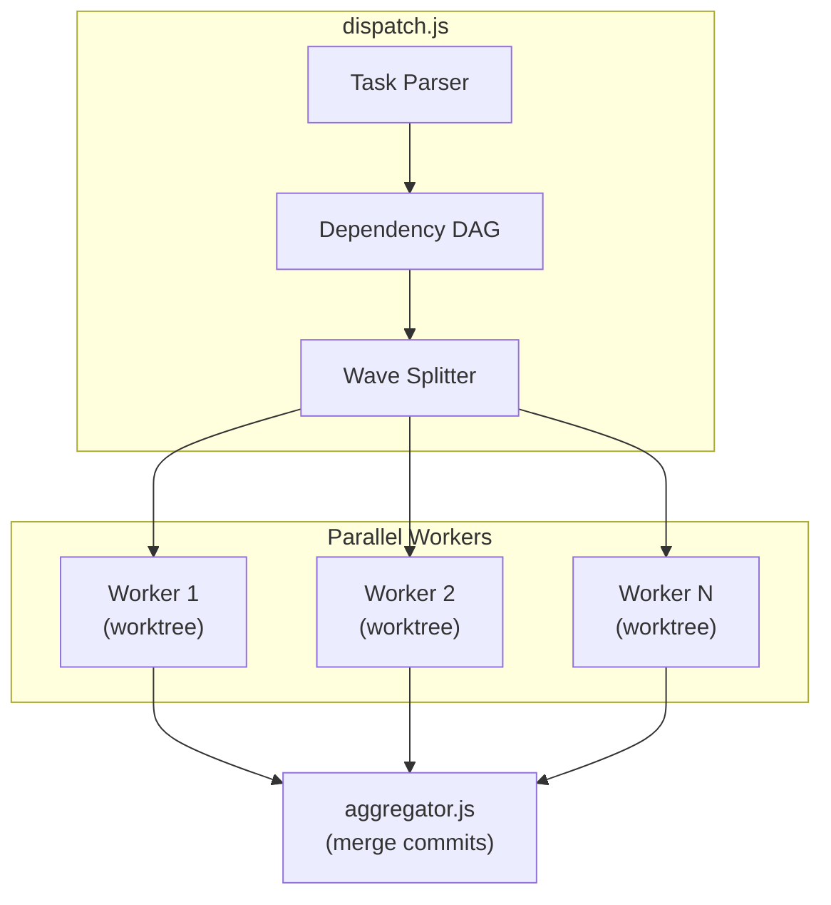

# Dispatch Algorithm Details

## Architecture



## Output Format Example

After dispatch completes, you'll see output like:

```
Dispatch Summary
================
Total tasks: 17
Waves: 4
Parallel limit: 4

Wave 1 (3 tasks): US01-research, US02-setup, US03-adapter
  ✓ US01-research completed in 45m
  ✓ US02-setup completed in 30m
  ✓ US03-adapter completed in 1h 15m

Wave 2 (5 tasks): US04-auth, US05-api, US06-db, US07-cache, US08-logging
  ✓ US04-auth completed in 2h
  ✓ US05-api completed in 1h 30m
  ✗ US06-db failed: merge conflict on schema.sql
  ✓ US07-cache completed in 1h
  ✓ US08-logging completed in 45m

Wave 3 (8 tasks): US09-US16 (skipped due to US06 failure)
Wave 4 (1 task): US17-docs (skipped due to dependencies)

Failed tasks: 1
Skipped tasks: 9
Successful tasks: 7
```

## Detailed Algorithm Steps

1. **Parse task files** - Read all US*.md files, extract metadata
2. **Build dependency graph** - Create directed acyclic graph from Preconditions
3. **Topological sort** - Order tasks by dependencies
4. **Split into waves** - Group tasks with no interdependencies
5. **Execute waves sequentially** - Each wave runs in parallel up to --parallel limit
6. **Monitor workers** - Track completion, timeout, failures
7. **Aggregate results** - Cherry-pick commits back to main branch
8. **Update task files** - Mark completed tasks with [x]
9. **Generate summary** - Report success/failure/skip counts