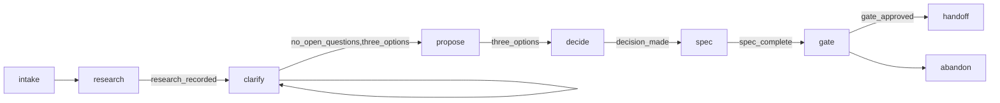

# X-Plan — Layered Spec-Driven Planning

Do not write any code until the spec is approved by the user. Pipeline order: `x-plan → x-epic → x-decompose → x-implement`.

## When to use

- "Plan this", "write a spec", "design X before coding".
- A vague goal you cannot yet name what to build for.
- You need three approaches with trade-offs before committing.

## Scenario

The run is a guarded graph. `state.json` is the single source of truth; `memory.md` records every
event; both sit at the root of the run folder, beside the numbered artifacts.



```bash
node <skill>/scripts/scenario.mjs start --slug <slug> [--goal <text>]
node <skill>/scripts/scenario.mjs record --dir <dir> --event research --data "<finding>"
node <skill>/scripts/scenario.mjs record --dir <dir> --event option --data "<approach>"
node <skill>/scripts/scenario.mjs record --dir <dir> --to <node>
node <skill>/scripts/scenario.mjs guard  --dir <dir> --gate <name>
node <skill>/scripts/scenario.mjs verify --dir <dir>   # exit 0 iff the stop is justified
```

| Gate | Passes when |
|------|-------------|
| `research_recorded` | at least one research finding is recorded |
| `no_open_questions` | every question in `memory.md` is answered |
| `three_options` | three distinct approaches are recorded |
| `decision_made` | the user picked an approach |
| `spec_complete` | the spec has `contract`, `invariant`, `test`, and `## Layers` |
| `gate_approved` | the user approved the handoff |

Completion: `verify` exits 0, or the run moved to `abandon`.

## Workflow

1. **Research first** — search the project, the web, and (for code) GitHub before asking anything. See `references/research-first.md`.
2. **Clarify** — ask short plain questions as panels (`single` / `multi` / `open` / `confirm`) until the open list is empty. See `references/questions.md`.
3. **Propose three approaches** — record each with a trade-off; let the user pick.
4. **Write the spec** — See Spec Format below. Always include a Layer Roadmap starting with L0 (prototype).
5. **Gate** — confirm with user before handing off to `x-epic`.

## Spec Format

Use declarations, not narrative. Section names are optional — include only what applies:

```
contract:     <interface or API shape>
invariant:    <what must always hold>
test:         <acceptance criterion with given/when/then>
constraint:   <non-functional requirement>
deferred:     <decided later>
```

Decision tree for classification: input/output → contract, system property → invariant, acceptance criterion → test, performance/security → constraint, postponed → deferred. If none match → clarify first. **No question → no section.**

Append `## Working notes` for scratch/hypotheses; strip at ship. Optional appendices (only if non-empty): Failure modes, Out of scope, Architecture.

For worked example: see `references/examples/design-spec.md`.

### Layer Roadmap (Required)

Every spec **must** include a `## Layers` section. Define layers from prototype to polish; fill in details during decomposition.

```markdown
## Layers

### L0 — <name: skeleton / prototype / foundation>
**Goal:** <what the prototype demonstrates — one sentence>
**What works:** <concrete: which flow completes end-to-end>
**What's mocked:** <which parts use stubs/mocks/fixed data and why>
**Definition of Done:**
- [ ] <automated check>: `<command>`
- [ ] System starts without errors

### L1 — <name: real implementation / core logic>
**Goal:** <what improves over L0>
**What changes:** <mocks replaced, logic added>
**Prerequisite:** Layer 0 complete and passing
**Definition of Done:**
- [ ] All L0 tests still pass (regression)
- [ ] <new testable behavior>

### L2 — <name: error handling / resilience>
**Goal:** <what improves over L1>
**What changes:** <new capabilities added>
**Prerequisite:** Layer 1 complete and passing
**Definition of Done:**
- [ ] <testable behavior>
```

#### Layer Design Rules

1. **L0 is always a prototype** — the first layer is always a working skeleton with mocks/stubs. If you can't describe what L0 does in one sentence, clarify before writing the spec.
2. **Each layer is independently testable** — after completing a layer, you should be able to run tests and see something work. If a "layer" only makes sense when combined with 3 others, it's not a layer — split it.
3. **Each layer removes one simplification.** L0 has the simplest version of everything. Each later layer replaces a mock with real logic, adds error handling, or improves quality.
4. **Layers have prerequisites** — L(N+1) depends on LN being complete. State this explicitly.
5. **Don't over-plan layers** — define 3-5 layers at the spec level. Details within each layer emerge during decomposition and implementation. It's OK if L4 is just a one-liner like "polish and documentation."

#### How to Define Layers (Decision Guide)

| Situation | Layer breakdown |
|-----------|----------------|
| Web page / UI | L0: basic layout with placeholder content → L1: real components → L2: interactivity → L3: styling/polish |
| API / backend service | L0: routes + mock handlers → L1: real business logic → L2: validation + error handling → L3: auth + middleware |
| Data pipeline (SQS/Lambda) | L0: sender → queue → mock lambda → response → L1: real processing logic → L2: error handling + DLQ → L3: monitoring |
| CLI tool | L0: argument parsing + stub action → L1: real action logic → L2: output formatting → L3: edge cases |
| Library / utility | L0: function signatures + mock returns → L1: real implementation → L2: edge cases + types |

**Rule:** writing "L1: header, L2: footer, L3: navigation" is component decomposition, not layer decomposition. Each layer must be a complete, runnable increment. If you need components, each component must be independently testable (each page renders on its own).

## Artifact Location

```bash
node <skill>/scripts/scenario.mjs start --slug <topic> [--new-run | --run <nn>]
```

- Run folder: `.x-skills/runs/YYYY-MM-DD-hhmm-R<nn>-<topic>/` — one folder per run, holding `state.json`, `memory.md`, and every artifact of the run.
- Artifacts are numbered `E<nn>-<kind>.md` or `E<nn>-<kind>/` in execution order, so a plain name sort lists the run in the order it was built.
- Spec report (handoff): `<run folder>/E00-plan.md` — the path `x-epic` reads.
- The topic reuses its existing run. Use `--new-run` to start a second run of it, and `--run <nn>` to join a specific one; with two runs and neither flag the command fails rather than picking.

## Abandon

If user decides not to proceed after clarification, stop. Record reason in working notes. No spec, no epic.

## Handoff Flow

Artifact must exist on disk with required declarations (contract, invariant, test) and a Layer Roadmap before handing off to `x-epic`. Prove it with `scenario.mjs guard --gate spec_complete` (exit 0).

## Files

- `scripts/scenario.mjs` — the run graph, guards, memory, and report writer.
- `scripts/check-questions.mjs` — enforces the B2 panel rules (`references/questions.md`).
- `scripts/save-spec.js` — writes the richer spec skeleton (`contract`/`invariant`/`test` + layers).
- `references/questions.md` — how to ask as a panel, and when to stop asking.
- `references/research-first.md` — the research pass before the first question.
- `references/examples/design-spec.md` — a worked spec.
